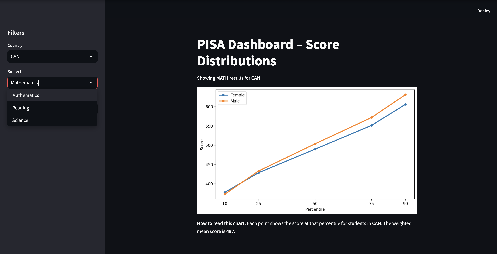

# ETS Smart Dashboard

**Gaurang Ahuja, Apoorva Srivastava, Sidharth Malik, Gloria Yi**

---

## Reproducing the Report

### 1. Clone the repository

```bash
git clone https://github.com/apoorva43/ETS_Smart_Dashboard
cd ETS_Smart_Dashboard
```

### 2. Add the data

The raw data is not tracked by git. Download it [here](https://drive.google.com/file/d/1xBM1twCzTA8ikwzmEGn7psqxDJBU0X_t/view?usp=sharing) 
and place it in: `data/raw/sampledat.csv`
> NOTE: The data file is large and hence hosted outside of GitHub.

### 3. Set up the environment

```bash
conda env create -f environment.yml
conda activate ets_capstone
```

### 4. Run the full pipeline

```bash
make
```

This runs three steps in order:
1. `python src/compute_stats.py` - computes weighted statistics and saves to `data/processed/stats.json`
2. `python src/figures.py` - generates all three report figures and saves to `data/images`
3. `quarto render reports/proposal/proposal_report.qmd --to pdf` - renders the final PDF report

---

## Run the App


### Live Demo
A hosted version of the app (2022 data only) is available on [Posit Cloud](https://019e4677-6a04-aa54-3548-1eae51bbdb21.share.connect.posit.cloud/).

> NOTE: This deployment runs on the `dev` branch and is limited to 2022 data due to memory constraints. For full multi-year data, run the app locally.

### Run Locally
The Streamlit App could be opened by using:
```bash
streamlit run app.py
```

Run it in dev mode for showing memory savings:
```bash
PISA_PROFILE_MEMORY=1 streamlit run app.py
```

This app would use data for all processed years located in the `data/processed` folder. Otherwise, it would use the sample data that contains only Canada and United States data.
