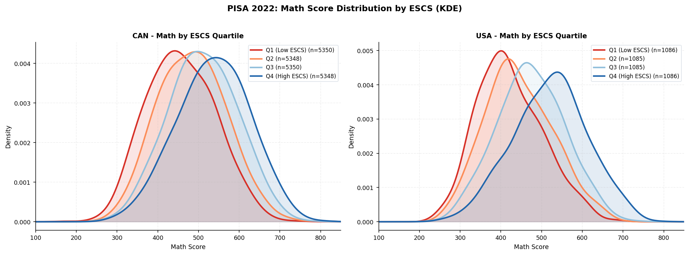

```{python}
#| label: setup
import json
with open("../../data/processed/stats.json") as f:
  s = json.load(f)
```

## Executive Summary

Educational assessment data is frequently reported as static average scores, omitting crucial context and leading policymakers to attribute performance disparities to demographic groups rather than systemic inequities. To address this, we developed an interactive data product for the Educational Testing Service (ETS) that visualizes full score distributions and contextual variables using Programme for International Student Assessment (PISA) data.

Processing over 1.7 million student records across the 2015, 2018, and 2022 cycles, the dashboard replaces mean-centric reporting with percentile profiles and intersectional visualizations. Driven by a highly optimized Parquet and DuckDB backend, the application computes complex sampling weights and plausible values in real-time. By providing a flexible, interactive interface, the tool guides non-technical policymakers toward fairer, contextually grounded interpretations of assessment data, actively reducing the risk of biased policymaking.

## Introduction

### Background and Problem Statement

International educational assessments serve as a primary benchmark for governments evaluating the efficacy of their education systems. However, relying solely on average scores to compare student groups obscures critical information: it hides within-group variation and ignores structural inequities, such as disparities in school resources.

Research demonstrates that this mean-centric approach causes audiences to attribute score differences to intrinsic group traits rather than systemic factors [@holder_dispersion_2022], with direct consequences for how education departments allocate resources. When data is presented without distributional context, the students most in need of support are the most likely to be mischaracterized and underserved. Aligning with ETS's mission regarding fairness and equity in assessment [@ets_mission], this project demonstrates that shifting how data is presented can directly drive more equitable policy decisions.

### Refined Scientific Objectives

While the initial goal was to build a dashboard to counter deficit thinking, the project evolved into concrete data science and engineering objectives to ensure the tool met the partner's needs at scale:

- **Objective 1: Scalable Computation of Complex Survey Data.** Analyzing PISA data requires computing 10 plausible values per subject and applying replicate student weights to generate accurate population estimates. The objective was to design an optimized data pipeline capable of computing these weighted percentiles dynamically across multiple years.

- **Objective 2: Distribution-Focused Visual Analytics.** To replace traditional bar charts, the project engineered statistical visualizations that map the full spectrum of student performance (e.g., 10th to 90th percentiles). This required custom interactive visualizations, such as jittered boxplots and shaded density curves, to visually expose within-group variance.

- **Objective 3: Flexible, Equity-Driven Exploration.** To ensure the data product serves diverse stakeholder needs, the final objective was to design a highly flexible interface. Rather than locking users into a rigid narrative, the dashboard allows policymakers to dynamically cross-reference contextual variables while utilizing automated text generation to filter out deficit-framing terminology

## Data

### Data Sources and Characteristics

The dataset originates from PISA, administered by the OECD every three years to nationally representative samples of 15-year-old students. PISA combines cognitive assessments in mathematics, reading, and science with background questionnaires covering socioeconomic status, immigration background, and school characteristics. The dashboard draws on the 2015, 2018, and 2022 cycles, encompassing 81 countries and economies and over 1.7 million student records [@oecd_pisa_2022].

Because PISA does not report a single observed score per student, the target variables are ten plausible values per subject—multiple imputed draws designed to account for measurement uncertainty [@oecd_pisa_2022_technical]. All score statistics reported in the dashboard are computed by averaging across all ten plausible values per the PISA technical standards. The working dataset was reduced to 133 equity-relevant variables, including the final sampling weight (`W_FSTUWT`). Sample sizes vary substantially by country—for instance, Canada contributes 23,073 student records in our working sample while the United States contributes 4,552—making the correct application of sampling weights essential for accurate cross-country comparisons.

[cite_start]To manage this scale, the data pipeline aggressively filters the raw PISA datasets into a highly optimized working format[cite: 60, 78]. The final scope of the data product is summarized in @tbl-data-scale.

| Metric | Scope | Description |
| :--- | :--- | :--- |
| **PISA Cycles** | 3 | [cite_start]2015, 2018, and 2022[cite: 54, 55, 56]. |
| **Coverage** | 81 Countries | [cite_start]Includes all OECD members and partner economies[cite: 289]. |
| **Student Records** | > 1.7 Million | [cite_start]Total observational units across the three cycles[cite: 48, 49, 50]. |
| **Feature Reduction** | 1,699 $\rightarrow$ 133 | [cite_start]Raw columns reduced to identifiers, sampling weights, and equity variables[cite: 60, 62]. |
| **Target Variables** | 10 per subject | [cite_start]Plausible values (`PV1`–`PV10`) requiring weighted aggregation[cite: 61, 65]. |
: Overview of the PISA dataset scale and feature reduction pipeline. {#tbl-data-scale}

### Exploratory Findings and Limitations

Two exploratory findings directly motivated the dashboard's design. First, aggregate score changes obscure highly uneven shifts across the distribution; for example, Canada's mathematics scores declined much more severely at the 10th percentile than at the 90th percentile between 2018 and 2022. Second, within-group variation is massive: students attending school in villages or large cities show overlapping score ranges, meaning geographic or socioeconomic group membership alone is a poor predictor of individual outcomes.

This dynamic is visually evident when comparing traditional mean scores against full distributions. [cite_start]Percentile lines reveal the full score spread from P10 to P90, exposing disparities in the tails that averages completely erase[cite: 160].

{#fig-percentile-profile}

TODO - Update the path to point to the actual screenshot of your percentile profile chart from the dashboard.

Missingness was minimal for variables like gender (0.2%) but higher for immigration background (10.9%). Variables with 100% missingness in our specific sample (e.g., optional parent questionnaires) were dropped entirely. A second limitation concerns comparability across cycles: the OECD periodically revises questionnaire items, meaning some contextual variables are not perfectly comparable across the three cycles. The dashboard surfaces this directly through warning messages rather than silently interpolating. Furthermore, the reliance on cross-sectional survey data deliberately limits the project's scope to descriptive reporting rather than causal modeling.

### Preprocessing

To handle memory constraints in the deployed environment, student and school-level files were merged and written to per-year Parquet files. Querying is performed on-demand using DuckDB, loading only necessary columns and country-year combinations. Records missing final sampling weights were excluded, and subgroup breakdowns are suppressed whenever the underlying sample falls below 30 valid observations to prevent the display of unstable estimates. Additionally, the complex structure of the data requires utilizing the 80 Fay BRR replicate weights per student to accurately estimate standard errors and flag unreliable country-year-subject estimates [@oecd_pisa_2022_technical].

## Data Science Methods

### Methodological Approach and Justification

The project utilizes a descriptive and distributional analytics approach rather than predictive modeling. The partner’s goal was not to predict individual achievement, but to help stakeholders explore educational equity patterns. Therefore, the primary data science task was transforming complex assessment data into interpretable visual summaries.

While weighted mean scores are computed to identify general disparities, averages compress the distribution. To address equity-focused questions, we computed weighted percentile profiles. These views allow users to examine whether subgroup differences are concentrated among lower-performing students, higher-performing students, or remain consistent across the distribution. Specific subgroups were tailored for interpretability: socioeconomic status (ESCS) was transformed into quartiles, school type was simplified into a public-versus-private grouping to avoid distracting from broader trends, and immigration status retained its distinct native, first-generation, and second-generation categories.

To accurately represent these subgroups without oversimplifying their outcomes, the dashboard utilizes jittered box plots (@fig-jitter-box). [cite_start]This deliberate design choice shows the actual density and clustering of students within specific groups, such as school locations[cite: 164, 165]. 

{#fig-jitter-box}

[cite_start]By overlaying raw jitter points on top of the interquartile range, the visualization proves that location is not destiny—many students from different contexts have vastly overlapping score ranges[cite: 153, 154].

TODO - update the image path to point to the new dashboard screenshot of the plot.

### Ethical Considerations and Limitations

A critical limitation of this methodology is that the dashboard provides descriptive evidence, not causal estimates. Differences between groups should not be interpreted as the direct effect of socioeconomic or immigration status, as these variables correlate with numerous unadjusted institutional factors.

Ethically, variables such as immigration status and gender can be sensitive if misconstrued as intrinsic explanations for performance. The dashboard treats these variables strictly as descriptive comparison groups, encouraging policymakers to view observed differences as reflections of overlapping systemic factors (e.g., school resources, language barriers) rather than inherent student deficits.

## Data Product and Results

### Product Description

The final product is a web application built using Streamlit and Plotly, designed for education ministry staff. The dashboard features two primary modes:

- **Data Story:** Guides users through a narrative for a selected country, exploring its standing relative to the OECD average, temporal trends, equity breakdowns, and school context factors. It utilizes an automated three-level callout system (key findings, uneven results, policy implications) generated dynamically from the data.

- **Explore Tab:** Allows users to freely interact with intersectional heatmaps, scatterplots, and side-by-side country comparisons without a rigid narrative structure.

### Strengths and Design Choices

Streamlit was selected over alternatives like React to maintain a unified Python codebase, enabling rapid iteration of the data pipeline and UI based on partner feedback. Statistically, the dashboard correctly implements PISA methodology using `DescrStatsW` for sampling weights and averages across all plausible values [@oecd_pisa_2022_technical]. Standard errors account for both sampling variance from the 80 Fay BRR replicate weights and imputation variance across plausible values. Standard error thresholds were implemented to display uncertainty information only when statistically significant (e.g., SE > 3.5 points), preventing visual clutter.

A primary design strength is the strict reliance on the OECD average as a reference point, which prevents the dashboard from encoding biased assumptions by manually suggesting "peer" countries for comparison.

### Current Limitations

The deployment environment (Posit Cloud) currently introduces memory constraints and slow cold starts. Additionally, the Data Story currently lacks a planned "Chapter 5" module intended to generate a copy-ready briefing summary for analysts. Finally, the dashboard does not yet fully implement replicate-weight variance estimation for all displayed statistics, positioning it as an exploratory decision-support tool rather than a formal inferential system.

## Conclusions and Recommendations

Education ministries traditionally focus on a country's mean PISA score and international rank. While a natural starting point, this approach misses critical nuances regarding the spread of student outcomes and the identification of marginalized groups. This product successfully shifts that focus, placing full score distributions and accessible equity breakdowns at the forefront of the user experience.

The dashboard effectively meets the partner’s core needs: users can quickly ascertain a country's standing, evaluate historical trends, and identify structural inequalities using interactive, non-deficit-framing visuals. However, a deeper, inherent limitation remains: while the tool can highlight a 40-point performance difference between demographic groups, it relies on the user's external contextual knowledge to determine why that disparity exists.

### Recommendations for Future Work:

- **Develop the Executive Summary Module:** Finalize and deploy the "Chapter 5" auto-generated text briefing to complete the core value proposition of the Data Story mode.

- **Enhance UI Consistency:** Standardize chart types across the Explore tab and unify the equity chapter layout to view multiple demographic breakdowns simultaneously.

- **Expand Historical Data:** Integrate the 2009 and 2012 PISA cycles to strengthen longitudinal trend analysis and provide a richer context for long-term policy impacts.

## References

::: {#refs}
:::